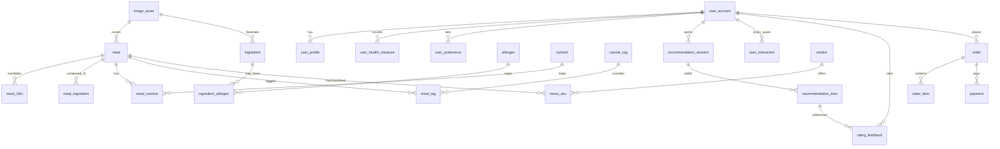

# Fitmealor – Data Schema (Draft)

> 목적: **개인 건강데이터 + 영양/알레르기 + 메뉴 정보**를 일관되게 저장 · 조회 · 분석하고, **추천/주문 플로우**를 안정적으로 지원하기 위한 관계형 스키마 초안입니다. 기본 타겟 DB는 **PostgreSQL 15+**(UUID, JSONB 사용) 기준으로 작성했습니다.

---

## 0) 범위 & 원칙

* **핵심 플로우**: 가입 → 건강정보 입력 → 추천 → 주문/저장 → 피드백 → 재추천(개인화)
* **모듈화**: 영양/알레르기/다국어/이미지/로그/피드백/주문을 분리
* **확장성**: 새로운 식단 유형(diet_type), 영양소 추가, 외부 상점/프랜차이즈 연계 가능
* **추적성**: 추천 근거(Features/Logs)와 사용자 상호작용(Feedback/Click/Order) 저장
* **성능**: 자주 조회되는 컬럼 인덱싱, 조인 빈도 높은 릴레이션에 보조 키 설계

---

## 1) 엔티티 개요

* **사용자 도메인**: `user_account`, `user_profile`, `user_health_measure`, `user_preference`
* **메뉴/재료/영양 도메인**: `meal`, `meal_i18n`, `ingredient`, `ingredient_allergen`, `meal_ingredient`, `nutrient`, `meal_nutrient`
* **알레르기/태그 도메인**: `allergen`, `diet_type`, `cuisine_tag`, `meal_tag`
* **추천/로그/피드백 도메인**: `recommendation_session`, `recommendation_item`, `user_interaction`, `rating_feedback`, `algo_feature_snapshot`
* **주문 도메인(초기 가상 기관)**: `vendor`, `menu_sku`, `order`, `order_item`, `payment`
* **미디어/운영**: `image_asset`, `audit_log`

---

## 2) ERD (Mermaid)



---

## 3) 테이블 스키마

### 3.1 사용자 도메인

#### `user_account`

* `id` UUID PK
* `email` text UNIQUE, not null
* `password_hash` text (또는 외부 OAuth의 경우 null)
* `auth_provider` text (local/google/apple/etc)
* `status` text default 'active' (active|blocked|deleted)
* `created_at` timestamptz, `updated_at` timestamptz

인덱스: `idx_user_account_email`(unique)

#### `user_profile`

* `id` UUID PK
* `user_id` UUID FK→user_account(id)
* `name` text
* `gender` text check in ('female','male','other','unspecified')
* `birth_date` date
* `height_cm` numeric(5,2)
* `weight_kg` numeric(5,2)
* `country` text, `locale` text default 'en'
* `created_at` timestamptz, `updated_at` timestamptz

인덱스: `idx_user_profile_user_id`

#### `user_health_measure`

* `id` UUID PK
* `user_id` UUID FK
* `measure_date` date not null
* `weight_kg` numeric(5,2)
* `bmi` numeric(5,2)
* `bmr` numeric(7,2) -- Basal Metabolic Rate
* `activity_level` text check in ('sedentary','light','moderate','active','very_active')
* `created_at` timestamptz

Unique: (`user_id`,`measure_date`)

#### `user_preference`

* `id` UUID PK
* `user_id` UUID FK
* `goal_type` text check in ('weight_loss','muscle_gain','balance','keto','low_carb','custom')
* `diet_type` text FK→diet_type(code)  -- 예: vegan/lacto_ovo/pescatarian/omnivore/carnivore
* `allergy_codes` text[]  -- FK allgeren(code)의 값들
* `disliked_ingredients` text[]  -- 자유 텍스트/코드 혼용 가능
* `target_kcal` int, `target_protein_g` int, `target_fat_g` int, `target_carb_g` int
* `last_updated_at` timestamptz

인덱스: `idx_user_pref_user_id`, GIN(`allergy_codes`)

---

### 3.2 메뉴/재료/영양 도메인

#### `meal`

* `id` UUID PK
* `canonical_name` text not null -- 기본 영문
* `description` text
* `image_asset_id` UUID FK→image_asset(id)
* `calories` numeric(7,2)
* `protein_g` numeric(7,2)
* `fat_g` numeric(7,2)
* `carb_g` numeric(7,2)
* `is_active` boolean default true
* `created_at` timestamptz, `updated_at` timestamptz

인덱스: `idx_meal_macro`, GIN(`to_tsvector('simple', canonical_name || ' ' || coalesce(description,''))`)

#### `meal_i18n`

* `id` UUID PK
* `meal_id` UUID FK
* `lang` text not null -- 'en','ko','ja' 등
* `name_local` text not null
* `desc_local` text
  Unique: (`meal_id`,`lang`)

#### `ingredient`

* `id` UUID PK
* `canonical_name` text not null
* `image_asset_id` UUID FK
* `is_active` boolean default true
* `created_at` timestamptz

#### `meal_ingredient` (N:M)

* `meal_id` UUID FK
* `ingredient_id` UUID FK
* `quantity_g` numeric(7,2)  -- 표준화된 무게(옵션)
* PK: (`meal_id`,`ingredient_id`)

#### `allergen`

* `code` text PK  -- 예: egg, milk, peanut, tree_nut, wheat, soy, fish, shellfish, sesame ... (KR 확장 가능)
* `display_name` text
* `severity_default` int default 2  -- 1=low,2=mid,3=high

#### `ingredient_allergen`

* `ingredient_id` UUID FK
* `allergen_code` text FK→allergen(code)
* `trace_possible` boolean default false
* PK: (`ingredient_id`,`allergen_code`)

#### `nutrient`

* `code` text PK  -- energy, protein, fat, carb, fiber, sugar, sodium 등
* `unit` text not null  -- kcal, g, mg ...
* `display_name` text

#### `meal_nutrient`

* `meal_id` UUID FK
* `nutrient_code` text FK
* `amount` numeric(10,3)
* PK: (`meal_id`,`nutrient_code`)

#### `cuisine_tag`

* `code` text PK  -- korean, japanese, western, halal, gluten_free, spicy, etc
* `display_name` text

#### `meal_tag`

* `meal_id` UUID FK
* `tag_code` text FK→cuisine_tag(code)
* PK: (`meal_id`,`tag_code`)
* 인덱스: (`tag_code`,`meal_id`)

---

### 3.3 추천/로그/피드백 도메인

#### `recommendation_session`

* `id` UUID PK
* `user_id` UUID FK
* `algo_version` text  -- 예: fitmealor-1.0.0
* `input_context` jsonb  -- 요청 시점의 상태(남은 목표 영양, 시간대, 위치 등)
* `created_at` timestamptz

#### `recommendation_item`

* `id` UUID PK
* `session_id` UUID FK
* `meal_id` UUID FK
* `rank` int not null
* `score` numeric(8,4) not null
* `filter_applied` jsonb  -- 사후 필터(알레르기, 종교, diet_type 등) 상세
* Unique: (`session_id`,`meal_id`)
* 인덱스: (`session_id`,`rank`)

#### `user_interaction`

* `id` UUID PK
* `user_id` UUID FK
* `session_id` UUID FK
* `meal_id` UUID FK
* `event_type` text check in ('impress','click','save','add_to_cart','purchase')
* `event_ts` timestamptz
* 인덱스: (`user_id`,`event_ts`), (`meal_id`,`event_type`)

#### `rating_feedback`

* `id` UUID PK
* `user_id` UUID FK
* `session_item_id` UUID FK→recommendation_item(id)
* `rating` int check 1..5
* `comment` text
* `created_at` timestamptz
* Unique: (`user_id`,`session_item_id`)

#### `algo_feature_snapshot`

* `id` UUID PK
* `session_id` UUID FK
* `feature_type` text check in ('user','meal','pair','context')
* `feature_payload` jsonb  -- 모델 입력/출력 특징량 기록(설명가능성)
* `created_at` timestamptz

---

### 3.4 주문 도메인 (가상 기관/프랜차이즈 연계 대비)

#### `vendor`

* `id` UUID PK
* `name` text not null
* `type` text check in ('virtual','franchise','partner') default 'virtual'
* `contact_phone` text, `address` text
* `is_active` boolean default true

#### `menu_sku`

* `id` UUID PK
* `vendor_id` UUID FK
* `meal_id` UUID FK
* `price_krw` int not null
* `is_available` boolean default true
* Unique: (`vendor_id`,`meal_id`)

#### `order`

* `id` UUID PK
* `user_id` UUID FK
* `vendor_id` UUID FK
* `status` text check in ('pending','paid','preparing','delivering','completed','canceled')
* `order_ts` timestamptz
* `completed_ts` timestamptz

#### `order_item`

* `id` UUID PK
* `order_id` UUID FK
* `menu_sku_id` UUID FK
* `qty` int check >0
* `unit_price_krw` int
* `line_total_krw` int

#### `payment`

* `id` UUID PK
* `order_id` UUID FK
* `provider` text  -- toss, kakao, stripe(가상)
* `amount_krw` int
* `status` text check in ('init','authorized','captured','refunded','failed')
* `paid_ts` timestamptz

---

### 3.5 미디어/운영

#### `image_asset`

* `id` UUID PK
* `url` text not null
* `alt_text` text
* `width` int, `height` int
* `created_at` timestamptz

#### `audit_log`

* `id` UUID PK
* `actor` text
* `entity` text
* `entity_id` text
* `action` text  -- create/update/delete/import
* `payload` jsonb
* `logged_at` timestamptz

---

## 4) 데이터 제약 & 규칙

* **알레르기 완전 배제**: 추천 시점에 `user_preference.allergy_codes` ∩ `ingredient_allergen.allergen_code` ≠ ∅ 인 `meal`은 사후 필터에서 제거 → `recommendation_item.filter_applied`에 기록
* **diet_type 준수**: 예) pescatarian → 육류 ingredient 포함 meal 제외
* **영양 목표 근접**: `user_preference`의 target_*과 `meal_nutrient`/`meal` 매크로로 거리함수 계산 → `recommendation_item.score`에 반영

---

## 5) 인덱스/성능 팁

* `recommendation_item(session_id, rank)` 복합 인덱스로 Top‑N 즉시 조회
* `user_interaction(user_id, event_ts)` 타임라인 분석 최적화
* 텍스트 검색은 **Postgres Full‑Text**: `meal` 이름/설명에 TSVECTOR
* 다중 포함 검색은 **GIN 배열 인덱스**: `user_preference.allergy_codes`

---

## 6) 시드/예시 데이터 (요약)

```sql
-- allergen
INSERT INTO allergen(code, display_name) VALUES
 ('egg','Egg'),('milk','Milk'),('peanut','Peanut'),('fish','Fish'),('shellfish','Shellfish'),('wheat','Wheat'),('soy','Soy'),('sesame','Sesame');

-- diet_type
INSERT INTO diet_type(code, display_name) VALUES
 ('vegan','Vegan'),('lacto_ovo','Lacto‑Ovo'),('pescatarian','Pescatarian'),('omnivore','Omnivore'),('carnivore','Carnivore');
```

---

## 7) 마이그레이션 가이드 (초안)

* v0 → v1: 핵심 테이블 생성 (`user_*`, `meal*`, `ingredient*`, `allergen*`, `recommendation_*`)
* v1 → v1.1: 주문/결제(`vendor`, `menu_sku`, `order*`, `payment`) 추가
* v1.1 → v1.2: 다국어(`meal_i18n`) 확장, 태그 구조 고도화(`cuisine_tag`, `meal_tag`)

---

## 8) 모델·피처 연결 포인트

* 모델 입력 피처: `algo_feature_snapshot(feature_type='user'|'meal'|'pair'|'context')`
* 사용자‑아이템 상호작용: `user_interaction` + `rating_feedback`를 통해 **implicit/explicit** 피드백 학습
* 오프라인 피처 빌드: 주기적 배치(예: Airflow)로 `user_profile`,`user_preference`,`interaction` 집계 → 모델 학습 테이블(추가 예정)

---

## 9) API/DTO 예시 (요약)

**추천 요청**

```json
POST /api/reco
{
  "user_id": "...",
  "context": {"time":"lunch","remaining_kcal":420,"locale":"en"}
}
```

**추천 응답**

```json
{
  "session_id": "...",
  "items": [
    {"meal_id":"...","rank":1,"score":0.87,
     "name":"Grilled Salmon Bowl","macros":{"kcal":520,"P":35,"F":18,"C":52},
     "i18n":{"ko":"연어 그릴 보울"},
     "filter_applied":{"allergen":[],"diet":"pescatarian"}}
  ]
}
```

---

## 10) 향후 보완 포인트

* 영양 파생 피처(에너지 밀도, PFC 비율, GL/당지수 등) 표준화 테이블
* `ingredient` ↔ `supplier`(원산지/성분표 OCR) 연결
* 모델 추적(MLflow/Weights&Biases)과 `algo_version` 동기화 자동화
* 개인정보 마스킹(PII)와 보존기간 정책

---

### 부록 A) 보조 테이블 정의

#### `diet_type`

* `code` text PK
* `display_name` text
* `rules` jsonb  -- 예: {"exclude": ["beef","pork","chicken"], "include": ["fish","seafood"]}

#### `image_asset` 예시 사용

* `meal.image_asset_id`/`ingredient.image_asset_id`로 1:N 연결 가능 (재사용 허용)


